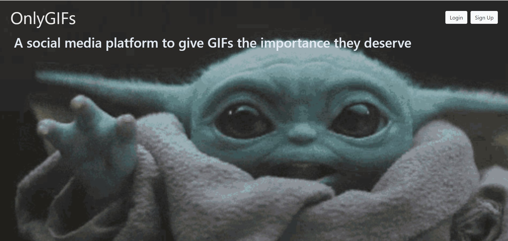
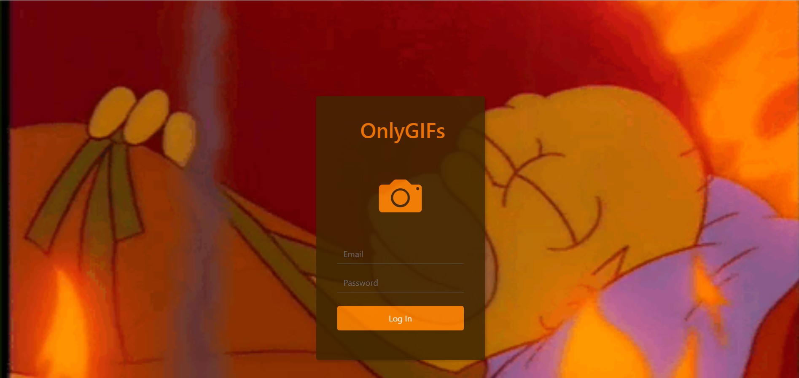
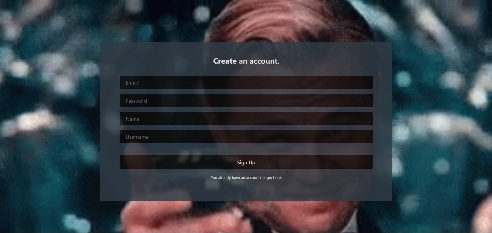
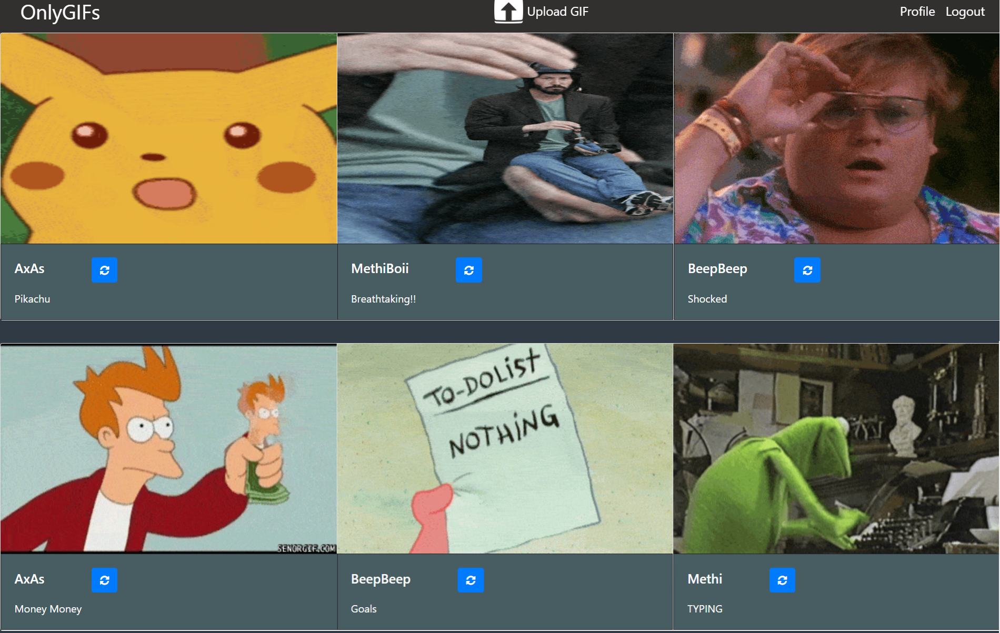
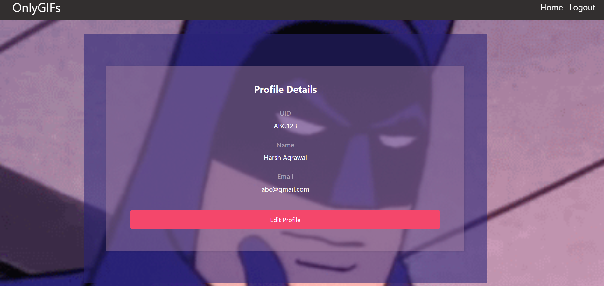
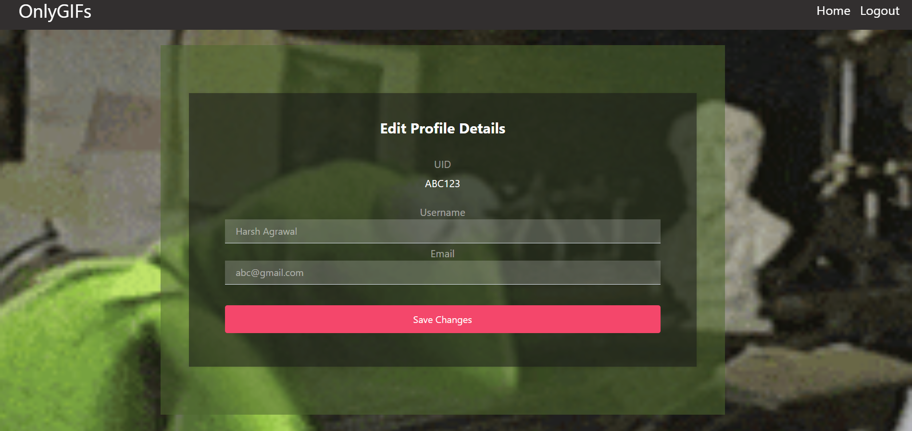
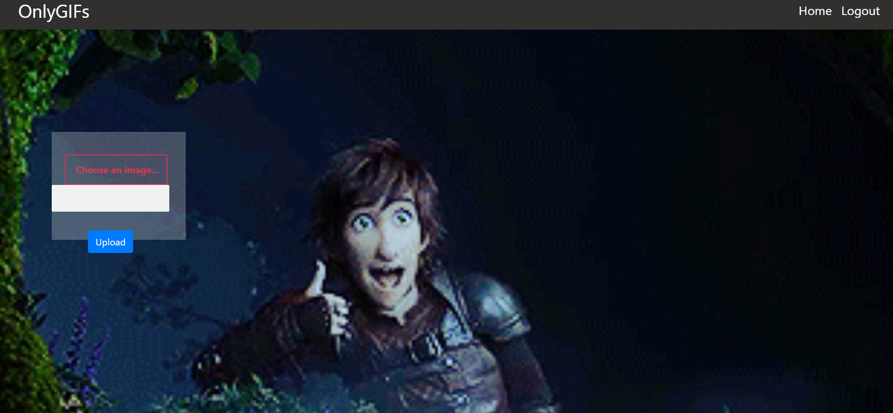

# OnlyGIFs
This project is a social media site dedicated to **GIFs** to give them the honour that they deserve. This website allows users to upload only GIFs with captions and see the GIFs uploaded by other users.  
  
**GIFs** are a series of images or soundless video that will loop continuously and doesn't require anyone to press play on it.
  
They are a very popular format for reactions to texts and this site serves as a platform for exchanging GIFs which users can download if they want to. Users will have to make an account by signing up on the site and they will be able to login to account whenever they want to.  
  
After logging in they will be able to upload GIFs and see GIFs uploaded by other users. On the homepage, clicking the refresh button will display a new set of GIFs from the database.
  
  
 Here is what is it looks like:
  
 ***1. Startup Page -***  
       
 
 
 ***2. Login Page -***    
    
 
   
 ***3. Signup Page -***   
     
 
 
 ***4. Home Page -***    
     
 
 
 ***5. Profile Page -***     
     
 
 
 ***6. Edit Profile Page -***    
     
 
 
 ***7. Upload Gif Page -***    
      
 

